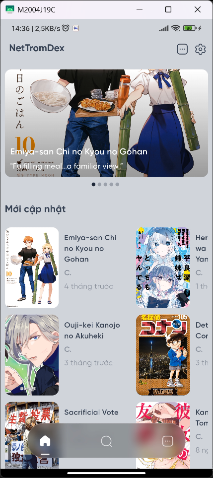
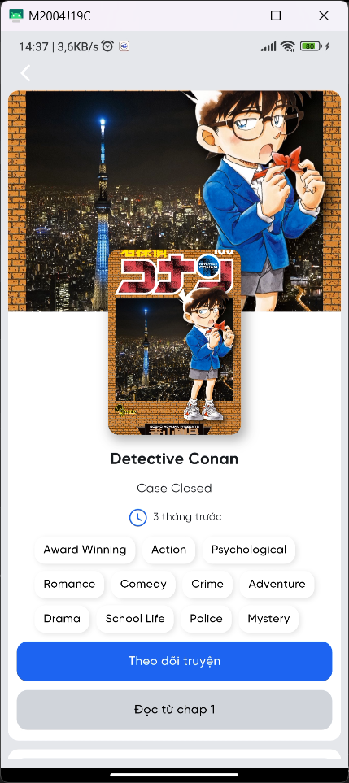
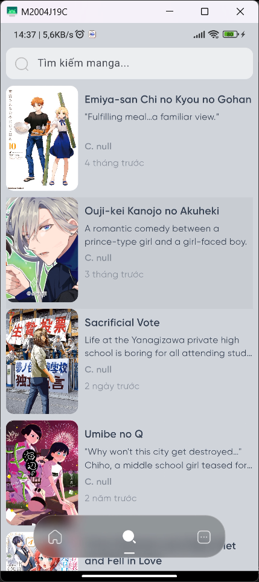

# NettromDex

## Giới thiệu

NettromDex là dự án ứng dụng đọc Manga online được xây dựng bằng Flutter, dữ liệu được lấy hoàn toàn từ MangaDex.
Giao diện mượt mà và thân thiện, có thể:

- Tìm kiếm và đọc toàn bộ truyện có trên MangaDex trong ứng dụng.
- Cập nhật chap mới nhất theo thời gian thực.

## Cài đặt

Hướng dẫn cài đặt và chạy project:

```bash
# Clone repository
git clone https://github.com/phongwild/NettromDex

# Chuyển vào thư mục project
cd NettromDex

# Cài đặt dependencies
flutter pub get

# Chạy ứng dụng
flutter run
```

## Chức năng chính

Đọc truyện: Xem các chương truyện trực tiếp từ MangaDex.
Tìm kiếm: Tìm kiếm theo tên truyện, tác giả, thể loại, ...

## Ảnh xem trước

| Trang chủ                                       | Chi tiết truyện                                         | Tìm kiếm (Filter)                                | Đọc truyện (Dọc)                                        | Đọc truyện (Ngang)                                      |
| ----------------------------------------------- | ------------------------------------------------------- | ------------------------------------------------ | ------------------------------------------------------- | ------------------------------------------------------- |
|  |  |  |  |  |

## Tài liệu tham khảo

- [Flutter Documentation](https://docs.flutter.dev)
- [MangaDex API Docs](https://api.mangadex.org/docs)

## License

Dữ liệu được lấy từ [MangaDex](https://mangadex.org) và tuân theo [Điều khoản sử dụng của MangaDex](https://mangadex.org/about).
Ứng dụng này không thuộc sở hữu của MangaDex.
